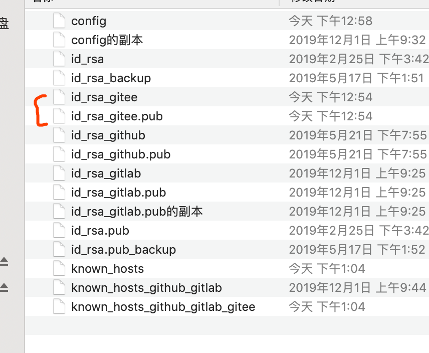
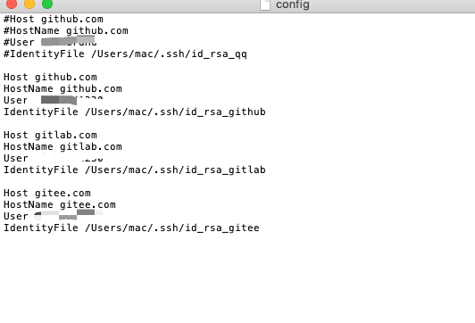
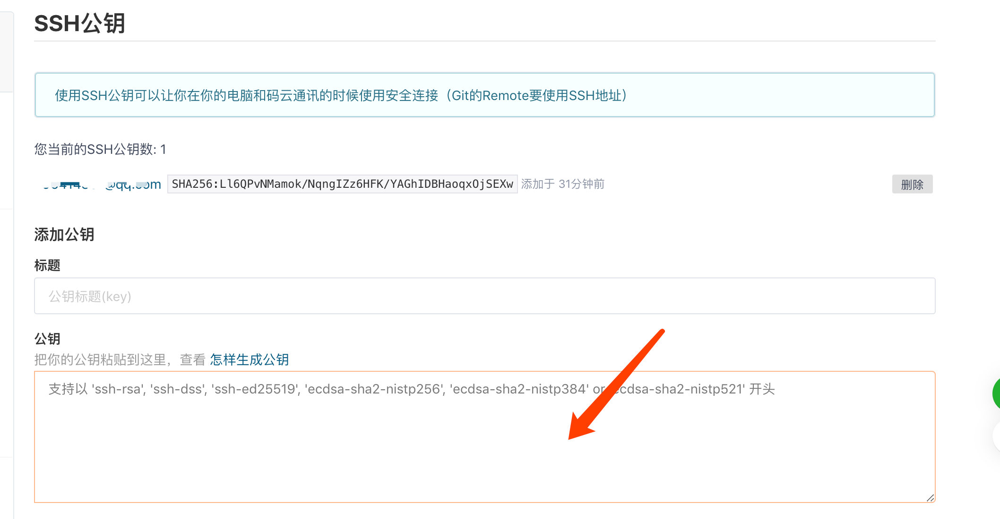
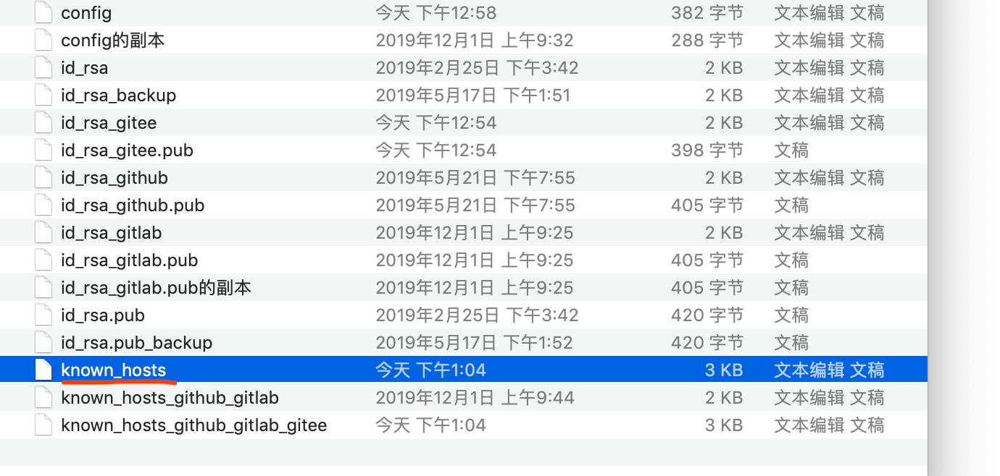

[TOC]
## 码云的ssh设置
### 生成新的公钥

### 编辑config
在 `.ssh`文件夹下新建 config 文件并编辑，令不同 Host 实际映射到同一HostName，但密钥文件不同。Host 前缀可自定义，如下所示
一个是github的，一个是gitlab的,一个是码云的

### SSHKeys
将生成的 id_rsa_gitee.pub里面的内容copy到gitee中SSHKeys里面(和github类似),而后点击Add Key即可

### 测试

## 推送项目代码

